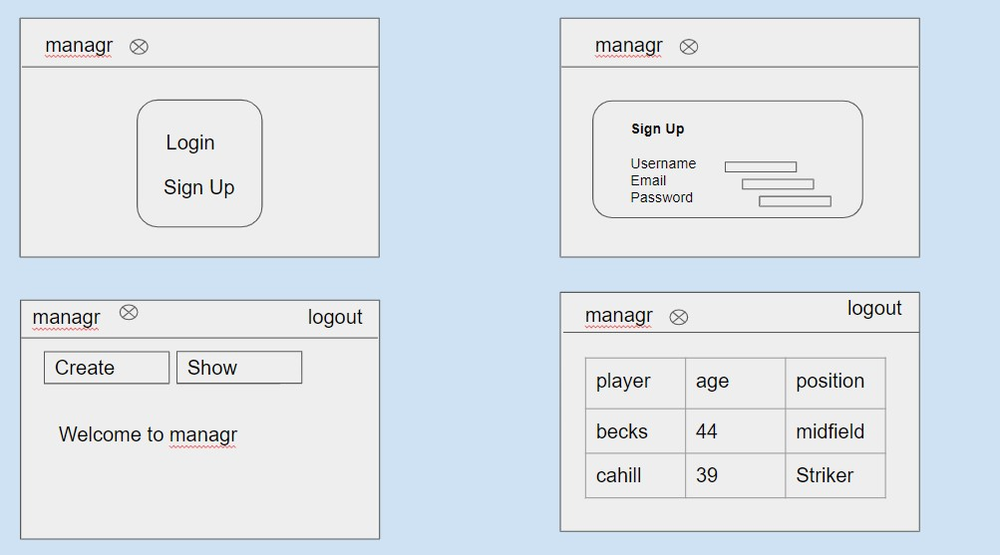
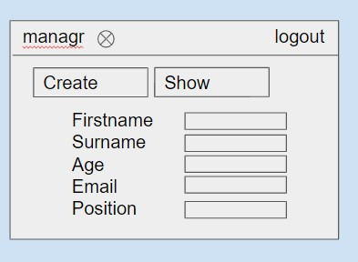
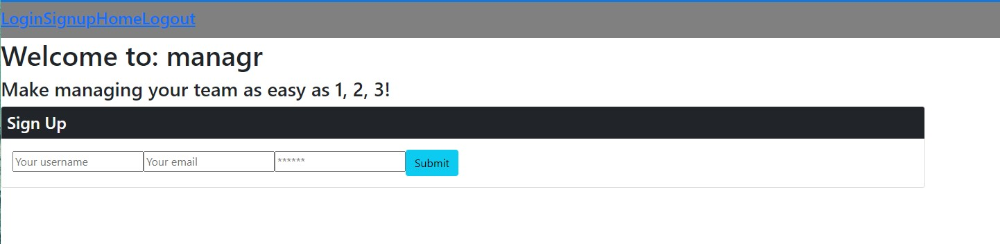
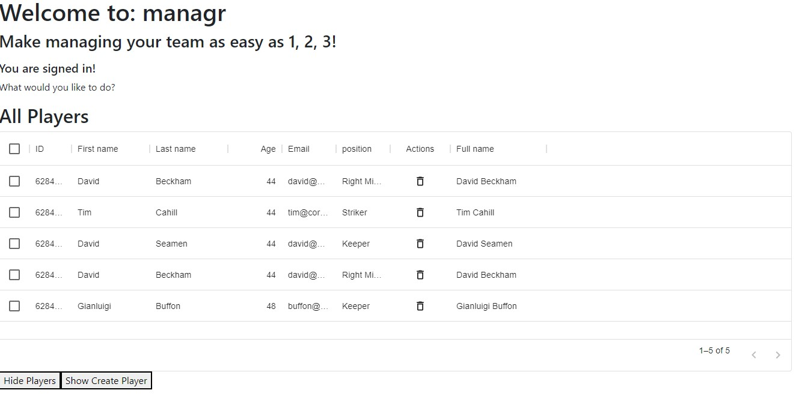
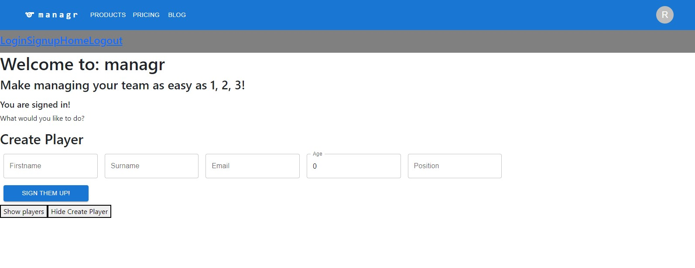

# managr
managr is a unique, full stack browser based application designed to help sports and community clubs manage activity, administrators and players. 
managr's intent is to provide digitalisation of resource management at a local level, so that anyone who has a managerial role within a community club has simple and digital means to co-ordiante members of their organisations.

## User Story

As an administrator of a local sports team,
I want to be able to record and update information about my team through a digital application
so that it becomes easier to manage and oversee our activities.

## Acceptance Criteria
- GIVEN the manager web domain
- WHEN I load the page
- THEN I am presented with an option to login / sign up. 
- WHEN I select sign up
- THEN I am required to create an account with username, email and password. 
- WHEN I select login
- THEN I need to enter my login details.
- WHEN I am logged in
- THEN I am presented with the home page with two buttons, show team & create player. 
- WHEN I select `Show Team`
- THEN I am presented with a list of current team members
- WHEN I select `Create Player`
- THEN I am presented with 5 input fields `firstname` `surname` `email` `age` `position`
- WHEN I select the `sign them up!' button
- THEN the player I have created is added to my list of players
- WHEN I select the delete action in the table
- THEN the player within the same row is removed from the table
- WHEN I selct `logout`
- THEN I am returned to the home page

## Description

The application provides users with the ability to login and register an account. 
Once logged in, they can access a pre-filled football team, although the user has the ability to add and remove players from this team.

The team data itself is currently running from a Mongo backend database and we are connecting this data to the front end using
- queries for reading and posting
- mutations for manipulation of data set

## Application

The application can be accessed here: https://aqueous-hollows-72320.herokuapp.com/

## Technologies used

- MongoDB - we elected this DB because we wanted to achieve seamless flow of json data between our front and backend
- Express - open source framework, simplifies application build through routing and increases time of delivery
- React - we want managr to be a single page application to enhance performance and improve user experience
- Node - was elected as it is useful for full stack deployments and enables us to connect both front and backend

- MUI Libraries - useful application - we were able to deploy active libraries to help with visual presentation of page and data

Example above of a form taken and build using the MUI Library.

## Contributors

This app was created and distributed by Oscar Bryant, student of the USYD Coding Boot Camp

Oscar Bryant
https://github.com/oscarcbryant

Presentation Link

Project submission date - May 19th, 2022
